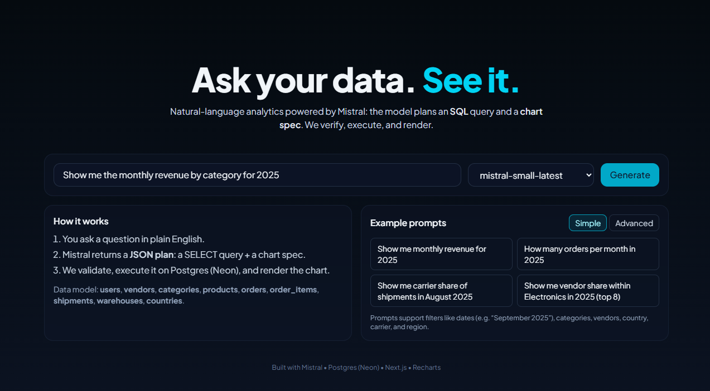
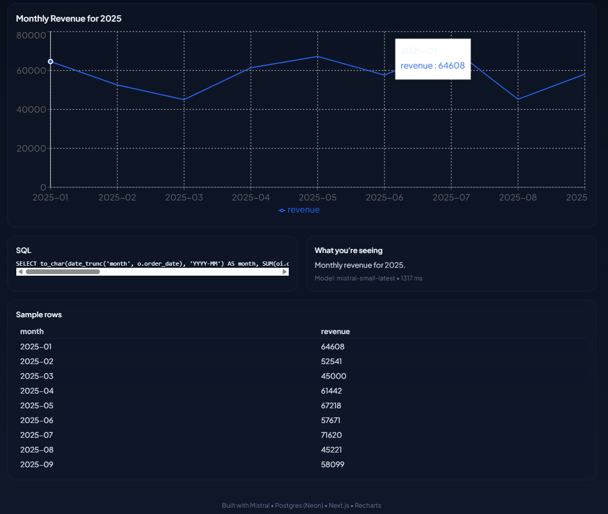

# Mistral Analytics Chatbot (Next.js + Neon + Recharts)

Natural-language → **validated SQL** → **charts**.
Type a question about your data; the app asks **Mistral**, guards & runs the SQL on **Postgres (Neon)**, and renders a chart with **Recharts**.

> _You’ll add screenshots where noted._ 😉

---

## ✨ What you get

- **Ask in plain English** → model returns a **JSON plan** (SQL + chart spec).
- **Guardrails**: SELECT-only, single statement, auto-`LIMIT 200`, basic row normalization.
- **Polished UI**: clean palette, truncation for long labels, currency & date formatting.
- **Realistic schema**: marketplace tables + **shipments/warehouses** for logistics; **countries** lookup for full country names.

---

## 🧱 Stack

- **Next.js (App Router)** + **TypeScript**
- **Postgres (Neon)** — free serverless tier
- **Mistral** JS SDK
- **Recharts** for visuals
- (Tailwind utilities used in components; any CSS works)

---

## 🚀 Quick start

1. **Clone & install**

   ```bash
   pnpm i   # or npm i / yarn
   ```

2. **Environment**
   Create `.env.local`:

   ```env
   MISTRAL_API_KEY=sk-...
   DATABASE_URL=postgresql://<user>:<pass>@<host>/<db>?sslmode=require
   ```

   > Neon: copy the **pooler** connection string and ensure `sslmode=require`.

3. **Seed data**

   - Base sample (users/vendors/categories/products/orders/order_items):

     ```bash
     npx tsx --env-file=.env.local scripts/seed.ts
     ```

   - World countries (ISO-2 → name):

     ```bash
     npm i world-countries
     npx tsx --env-file=.env.local scripts/seed_countries.ts
     ```

   - Logistics (warehouses + shipments): included in `seed.ts`. If you created tables manually, run the script again; it’s idempotent.

4. **Run**

   ```bash
   pnpm dev  # http://localhost:3000
   ```

---

## 🗂️ Database model (what’s available)

_Feel free to paste a schema screenshot here._

**Core**

- `users(id, country, signup_date)`
- `vendors(id, name, rating)`
- `categories(id, name, parent_id)`
- `products(id, vendor_id, category_id, price, created_at)`

**Facts**

- `orders(id, user_id, order_date, status, total_amount)`
- `order_items(order_id, product_id, qty, unit_price)`

**Logistics & lookup**

- `warehouses(id, city, region)`
- `shipments(id, order_id, warehouse_id, carrier, shipped_at, delivered_at)`
- `countries(code CHAR(2), name TEXT)` ← join to show full country names

**Helpful definitions**

- **Revenue** = `SUM(order_items.qty * order_items.unit_price)`
- **Delivery time (hours)** = `AVG(EXTRACT(EPOCH FROM (delivered_at - shipped_at))/3600)`
- **Monthly bucket** = `to_char(date_trunc('month', <date>), 'YYYY-MM')`

---

## 🧠 Prompting & Catalog

- **`lib/catalog.ts`**: tiny text summary of allowed tables/columns & business rules.
  Keeps the model grounded (no “`orders.vendor_id`” hallucinations).
- **`lib/prompt.ts`**: strict **SYSTEM** rules + 2 few-shots. Highlights:

  - JSON-only output (`sql`, `chart`, `explanation`)
  - SELECT-only; alias tables & reuse aliases everywhere
  - Group by expression → `GROUP BY 1` (or repeat the expression)
  - Prefer **long shape** for grouped comparisons (e.g., H1 vs H2)
  - Pie only for small, single-period distributions (≤ 8 slices)

**Example (few-shot)**

> _Top 20 countries by orders_
> Joins `users.country` → `countries.code`, groups with `GROUP BY 1`, returns a bar chart.

---

## 🔌 API

**`POST /api/ask`**

**Request**

```json
{
  "question": "Show me monthly revenue by category for 2025",
  "model": "mistral-small-latest"
}
```

**Response**

```json
{
  "rows": [{ "month": "2025-01", "category": "Electronics", "revenue": 12345 }],
  "chart": {
    "type": "bar",
    "xField": "month",
    "yField": "revenue",
    "seriesField": "category",
    "title": "Monthly Revenue by Category (2025)"
  },
  "explanation": "Monthly revenue grouped by category for 2025.",
  "sql": "SELECT ... LIMIT 200;",
  "model": "mistral-small-latest",
  "latencyMs": 842
}
```

**Errors**

- `400` — Bad plan/SQL: non-SELECT, multiple statements, PG error (shown).
- `503` — Model capacity: retry or switch model.
- `500` — Server error.

---

## 🛡️ Safety & reliability

- **Guardrails**

  - Rejects non-`SELECT` & multi-statement SQL
  - Auto-adds `LIMIT 200`

---

## 🎨 UI / UX





**Main parts**

- **AskForm**: natural question + model dropdown; “Generate”.
- **Examples**: curated simple & advanced prompts (line/bar/pie coverage).
- **Explainer**: short “How it works” + “Data available” section.
- **ChartPanel** (Recharts):

  - **Bar/Line/Pie** via model’s `chart` spec
  - **Per-series colors** (stable palette); **per-bar colors** for single-series categories
  - **Truncated x-axis** labels + tooltips
  - **Currency & date formatting** via `Intl` helpers (`lib/format.ts`)

**Data shape expectations**

- _Time series_ → `xField = "month"` (`YYYY-MM`) or a date key
- _Ranking_ → `xField = dimension`, `yField = value`
- _Grouped_ → **long**: `xField`, `seriesField`, `yField`
- _Pie_ → single period distribution with ≤ 8 categories

---

## 🔩 Key file tour

```
app/
  api/ask/route.ts     # hero endpoint: prompt, guard, retry, repair, run SQL
  page.tsx             # layout + wiring

components/
  ask-form.tsx         # input, model select, run
  examples.tsx         # curated prompts (simple/advanced/pie)
  explainer.tsx        # short how-it-works + data available
  chart-panel.tsx      # Recharts (bar/line/pie), formatting, truncation

lib/
  db.ts                # pg client
  prompt.ts            # SYSTEM_PROMPT with rules + few-shots
  catalog.ts           # schema summary fed to the model
  ui.ts                # colorFor, pivotLongToWide, helpers

scripts/
  seed.ts              # base + logistics data
  seed_countries.ts    # ISO-2 → country names (uses world-countries)
```

---

## 💡 Examples you can try

**Simple**

- “Show me monthly revenue for 2025”
- “How many orders per month in 2025”
- “Show me vendor share within Electronics in 2025 (top 8)”

**Advanced**

- **Line**: “Show me monthly average delivery time (hours) by carrier in 2025”
- **Bar**: “Show me top 10 vendors — revenue in H1 2025 vs H2 2025”
- **Pie**: “Show me order status distribution in September 2025”
- **Line**: “Show me monthly revenue in 2025 by user signup cohort (quarter)”
